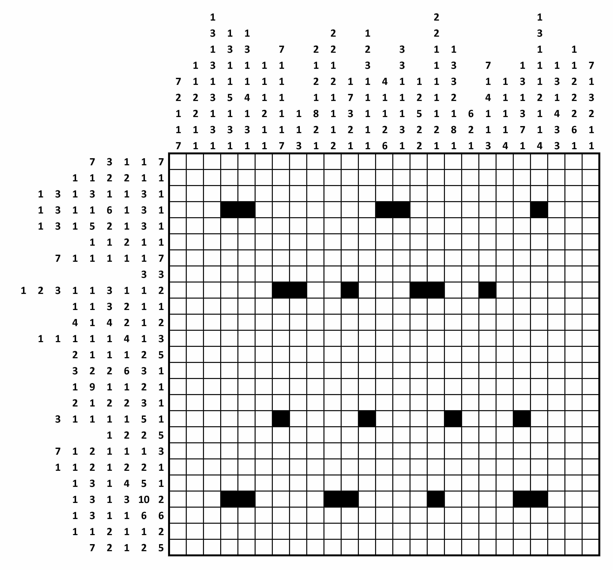

# picross-solver
[Picross](https://en.wikipedia.org/wiki/Nonogram) puzzle solver, written for the [GCHQ Director's Christmas puzzle challenge 2015](http://www.gchq.gov.uk/press_and_media/news_and_features/Pages/Directors-Christmas-puzzle-2015.aspx). Solves the puzzle in about 2 seconds.

**Disclaimer / spoiler alert:** Don't run this code if you have any plans to try to solve this puzzle yourself.

The algorithm first uses constraint satisfaction to resolve most of the board just using the row and column constraints specified in the image below, successfully determining the color of all but 25 grid cells, followed by backtracking search to figure out these last ambiguous cells. The solved puzzle grid is a QR code containing a URL which takes you to the second stage of the puzzle.

Original puzzle description:
```
In this type of grid-shading puzzle, each square is either black or white. Some of the black squares have
already been filled in for you.

Each row or column is labelled with a string of numbers. The numbers indicate the length of all consecutive
runs of black squares, and are displayed in the order that the runs appear in that line. For example, a
label "2 1 6" indicates sets of two, one and six black squares, each of which will have at least one white
square separating them.
```



The code is (C) 2015 Luke Hutchison; MIT-licensed.
